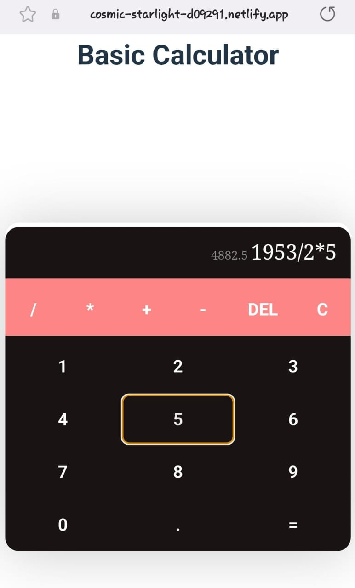

## 🖩🖩 Basic Calculator App 🖩🖩

## Version 1.0.0

A basic calculator app built using HTML, CSS, JavaScript, TypeScript, and React.js.

## Technologies Used

- HTML
- CSS
- JavaScript
- TypeScript
- React.js
- Vite

## Features

- Perform basic arithmetic operations.
- User-friendly interface.

## Demo

file:///home/randeera/Videos/Screencasts/ksoft-basic-cal.webm




## Getting Started

### Prerequisites

- Make sure you have [Node.js](https://nodejs.org/) installed on your machine.

### Installation

1. Clone the repository:

   ```bash
   https://github.com/randeera/k-soft-basic-calculator-app.git

2. Go to inside the directory:

   ```bash
   cd k-soft-basic-calculator-app

3. install Dependencies:

   ```bash
   npm install

4. Run the app:

   ```bash
   npm run dev
